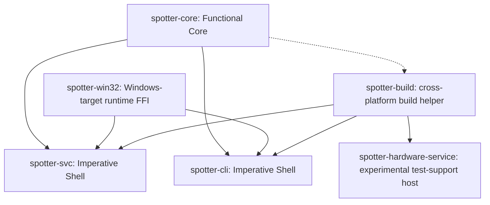
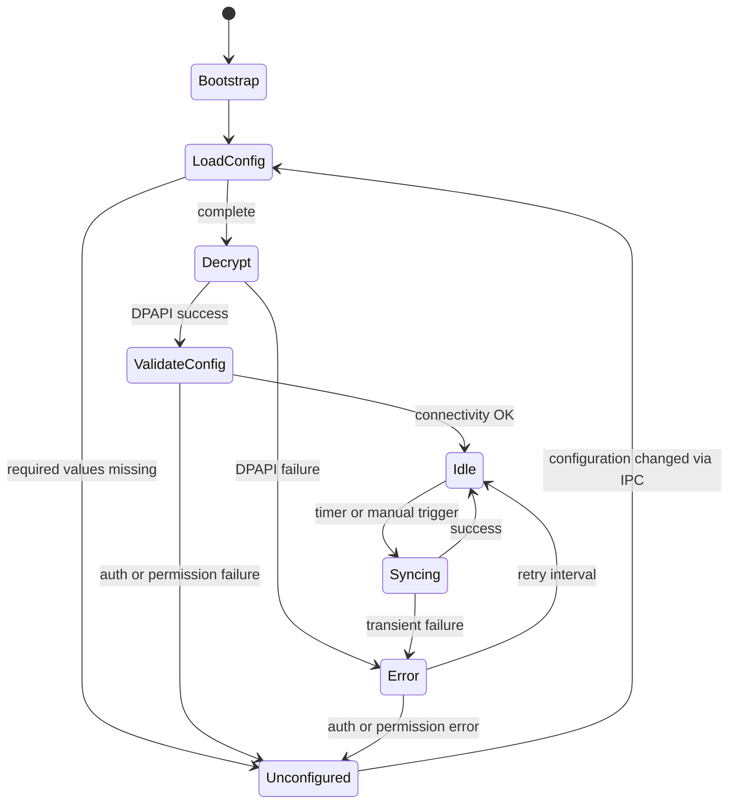
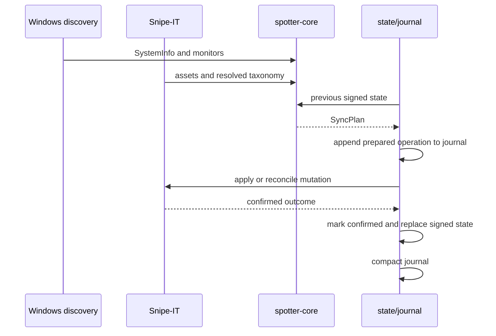

# SnipeSpotter architecture

SnipeSpotter separates deterministic decisions from operating-system and network I/O using the Functional Core / Imperative Shell (FCIS) pattern.

## Crate dependency graph

Dependency rules:

- `spotter-core` has zero I/O, no async, no platform-specific FFI. `cfg(windows)` is permitted only for path constants that select a directory root without performing I/O.
- `spotter-svc` and `spotter-cli` never import from each other.
- `spotter-win32` is a Windows-target runtime crate. It is not a cross-platform dependency and is kept behind Windows target dependencies in the service and CLI.
- `spotter-build` is a cross-platform build helper. Its build script can compile without invoking an RC compiler on non-Windows targets; resource compilation runs only for supported Windows MSVC targets. The helper can therefore be used by the production binaries and the experimental hardware-service host without making the runtime crates Windows-only.
- The workspace contains exactly six packages: `spotter-core`, `spotter-win32`, `spotter-build`, `spotter-svc`, `spotter-cli`, and `spotter-hardware-service`. `spotter-hardware-service` is an experimental/test-support LocalSystem host for the hosted hardware observation workflow. It is not included in the installer or release artifacts.
- `spotter-build` reads `spotter-core` source at build time (file parse, not crate dependency).

## Crate responsibilities

### spotter-core (Functional Core)

Owns all domain logic with no side effects:

- **Configuration schema** (`config.rs`): `Settings` with nested `SnipeItSettings`, `PollingSettings`, `LoggingSettings`, `MonitorSettings`. TOML round-trip, `serde(default)`, `config_status()` for missing-field detection.
- **Identity constants** (`identity.rs`): `PRODUCT_NAME`, `COMPANY_NAME`, derived `SERVICE_NAME`, `PIPE_NAME`, `MUTEX_NAME`, and `data_dir()`.
- **SMBIOS parser** (`smbios.rs`): `parse_smbios_tables(raw: &[u8]) -> Result<SystemInfo, SmbiosParseError>`. Parses Type 1/2/3 tables and string tables. `ChassisType` with `is_portable()` for types 8-12, 14, 30-32.
- **Monitor data** (`monitors.rs`): `MonitorInfo`, `MonitorSyncState`, `MonitorSyncEntry`. `diff_monitors()` computes new/removed/unchanged monitors with typed UTC timestamps.
- **Snipe-IT models** (`snipeit/`): `Asset`, `AssetModel`, `Manufacturer`, `Category` response types. Request builders for PATCH, checkout, and check-in. Endpoint-specific classifiers that consume HTTP status + wire body and return structured `SnipeItError` variants.
- **Sync planning** (`sync.rs`): `plan_sync()` is the pure planner. Takes resolved taxonomy, monitor state, policy, and a supplied `now` timestamp. Returns `SyncPlan` with asset updates, checkouts, checkins, next monitor state, and warnings. Missing taxonomy suppresses mutations and emits warnings.
- **IPC protocol** (`ipc.rs`): `ServiceCommand` and `IpcResponse` enums with serde tagging. `SettingsUpdate` for typed config field updates. `validate_config_field()` for client-side validation. 64 KiB line limit.
- **Service state** (`state.rs`): `ServiceState` with HMAC-SHA256 signing. `canonical_bytes()` excludes the HMAC field. Constant-time verification via `subtle`.

### spotter-win32 (Windows FFI)

Narrowly scoped unsafe wrappers with RAII ownership:

- **DPAPI** (`dpapi.rs`): `encrypt()` / `decrypt()` using `CryptProtectData` / `CryptUnprotectData` with `CRYPTPROTECT_LOCAL_MACHINE` and `CRYPTPROTECT_UI_FORBIDDEN`. Decryption returns a `Zeroizing<Vec<u8>>`; the DPAPI allocation is wiped over exactly `cbData` bytes before the RAII guard calls `LocalFree`, including failure and null/zero-length cases.
- **Named mutex** (`mutex.rs`): `try_acquire_global_mutex()` using `CreateMutexW` with `ERROR_ALREADY_EXISTS` detection. Mutex name: `Global\SnipeSpotter`.
- **Pipe DACL** (`pipe.rs`): `create_admin_pipe_security_attributes()` builds an SDDL descriptor granting generic-all to SYSTEM (`SY`) and built-in Administrators (`BA`), with no handle inheritance.
- **Elevation** (`elevation.rs`): `is_elevated()` checks whether the current process has administrator rights.

### spotter-build (Build helper)

Parses `PRODUCT_NAME` and `COMPANY_NAME` from `spotter-core/src/identity.rs` at build time and passes them to the RC compiler. Embeds `VERSIONINFO` and STRINGTABLE resources when the target is Windows MSVC; non-Windows targets emit rerun directives and skip resource compilation. The CLI exe gets a `requireAdministrator` manifest; the service exe gets `asInvoker`.

### spotter-hardware-service (Experimental test-support host)

Provides the temporary Windows service host used by the manual hosted hardware experiment. When built with the `hardware-experiment` feature on Windows, it runs the bounded collector as a LocalSystem service process and reports service status to SCM. It is test support, not a product service: the installer and release workflow exclude it.

### spotter-svc (Service shell)

Implements the Gather -- Process -- Persist cycle:

- **FSM** (`fsm.rs`): Enum + match loop. All states visible in one function. The FSM is the single owner of active config, Snipe-IT client, sync execution, and in-memory state. Commands are serialized: one sync/check-in at a time, duplicate triggers coalesce with generation tracking, config updates commit atomically. Status commands read an immutable published snapshot before the mutation queue, so they return committed data while a sync is gated in flight.
- **Status publication** (`status.rs`, `status_publisher.rs`): The owner publishes an immutable committed-state snapshot (state, last sync, endpoint, matched asset, monitors) through a watch channel at every real activation — startup recovery, mutation start, state-save activation, failure transitions, config activation, and saved-candidate activation. A second watch carries the scheduler's schedule projection paired with the configuration generation it observed; readers suppress `next_sync` when unconfigured or when the generation is stale. Snapshots never contain tokens, ciphertext, or journal payloads.
- **Scheduler** (`scheduler.rs`): The completion-relative automatic sync scheduler. Activation arms one full interval from activation; only actual interval changes or configured/unconfigured transitions reset the deadline (unrelated or no-op saves never do); each automatic completion arms the next interval from completion, so there is no fixed-rate catch-up and no overlapping automatic work. `next_sync` means the next automatic enqueue attempt and is paired with the monotonic deadline; wall-clock changes never alter monotonic cadence. Completion tracking uses a retained monotonic generation so completion before waiter registration cannot be lost, and a closed channel terminates the scheduler cleanly.
- **Production owner test boundary** (`service.rs`): `CommandOwner::handle` is the production orchestration subject. Its external boundaries are intentionally narrow: secret protection, settings persistence, signed-state persistence, journal persistence, clock inputs, path inputs, hardware discovery, remote reads, and remote mutations. Test-support construction replaces those boundaries with test ports and unique temporary roots/endpoints, then exercises the same command-handling FSM; production construction continues to use DPAPI, ProgramData, Windows discovery, and the authenticated Snipe-IT client.
- **Hardware discovery** (`discovery.rs`): `discover_hardware()` calls `GetSystemFirmwareTable` for SMBIOS and WMI `WmiMonitorID` for monitors. Abstracted behind a `HardwareDiscovery` trait with real and mock implementations.
- **Snipe-IT client** (`snipeit_client.rs`): `reqwest`-based HTTPS-only client with native-tls, bearer token auth, rate limit handling (`X-RateLimit-Remaining`, `Retry-After`), parsed URL construction, and bounded response/pagination handling. Responses are capped at 1 MiB (16 KiB for error bodies); requests at 30 seconds; pagination at page size 100, 100 requests, 10,000 rows, and 60 seconds total. Redirects are classified without being followed. Production URL acceptance requires HTTPS through one shared core validator (`validate_snipeit_url`) used by settings, IPC updates, and both constructors; a crate-visible `cfg(test)` loopback-only HTTP seam exists solely for sibling unit tests and never softens production validation.
- **Sync engine** (`sync_engine.rs`): Orchestrates gather (discover hardware, find assets by serial, resolve taxonomy, load prior state) -- process (`plan_sync()`) -- persist (journal each operation, reconcile before execution, mark confirmed, persist state delta).
- **IPC server** (`ipc_server.rs`): Named-pipe server with JSON-over-newline protocol. Transport handlers validate framing and enqueue `FsmCommand` values to the FSM. Each request carries a one-shot response sender for committed results. The accept loop keeps at most 16 concurrently active sessions in a `JoinSet`; excess connections are accepted and promptly closed (bounded, not fair under deliberate saturation), the next secured listening instance is created promptly, and DACL/SQOS semantics are unchanged. Cooperative shutdown stops accepting, drains active sessions under a fixed 5-second deadline, then aborts leftovers and observes their joins — transport timeouts and shutdown never cancel queued owner handlers.
- **Config I/O** (`config_io.rs`): Uses the shared same-directory replacement writer. On Windows, an existing destination is replaced with `ReplaceFileW`; a first create uses `MoveFileExW` with replace-existing and write-through flags. The temporary file is flushed before replacement, its protected ACL is applied before writing and reapplied to the destination after replacement, and a parent-directory flush is best effort: a failed directory-open emits one bounded, value-free diagnostic and the write still succeeds, while a failed directory sync propagates an actionable error after the replacement (the destination bytes are already changed; no rollback is claimed).
- **State I/O** (`state_io.rs`): HMAC-signed state uses the same replacement contract. The process-level guarantee is old-or-new: readers observe either the complete prior file or the complete replacement, never a partially written destination. Temporary names carry the owning PID and nonce, and the matching owner sidecar records the same `PID:nonce` pair. Recovery verifies that owner, checks the owner is dead, and requires a conservative age threshold; malformed, unowned, current-process, live-owner, or too-new files remain untouched. This is process-interruption evidence, not a physical power-loss guarantee, and the writer does not define concurrent multi-writer coordination.
- **Operation journal** (`operation_journal.rs`): Append-only, fsynced journal of `Prepared` → `RemoteOutcomeObserved` → `StateCommitted` records with deterministic IDs. Startup classifies the journal before configuration branching, DPAPI decryption, remote-client construction, owner creation, recovery, or IPC. Only a `Clean` result reaches normal recovery; ambiguous evidence is preserved and never replayed through the operator-recovery result.
- **Logging** (`logging.rs`): `tracing-subscriber` with `tracing-appender` rolling file appender. Daily rotation, configurable level and retention.
- **Service registration** (`service.rs`): `windows-service` crate for SCM integration. Service name: `SnipeSpotter`, account: `LocalSystem`, start type: automatic.

### spotter-cli (CLI)

`clap` derive with nested subcommands. Depends on injectable `IpcTransport`, `ServiceRegistrar`, `ElevationChecker`, and `TokenReader` ports. Unit tests use fakes; production adapters perform named-pipe, SCM, console, and elevation I/O.

## Owner seams and evidence layers

`CommandOwner::handle` is the production orchestration subject. Tests replace only its external boundaries; the owner, command handling, and FSM remain real. The constructor keeps these seams narrow:

| Seam | Production boundary | Test boundary |
|---|---|---|
| Secret protection | Machine-scope DPAPI through `spotter-win32` | Deterministic secret-protector fake |
| Settings, state, and journal stores | `%ProgramData%` files, signed state, and the atomic writer | In-memory or temporary stores with recorded saves |
| Remote reads and mutations | One authenticated `SnipeItClient` | Scripted remote port and factory |
| Hardware discovery | Windows SMBIOS/WMI discovery | Fixed or failing discovery port |
| Time, paths, and runtime identity | Product constants and the service runtime options | Fixed clock plus unique temporary roots, pipes, mutexes, and service names |

The fake ports stop at I/O boundaries. They do not replace planning, candidate-state validation, journal ordering, command serialization, or commit-before-response behavior.

Evidence has explicit limits:

| Evidence layer | What the repository exercises | What it does not establish |
|---|---|---|
| Functional core | Cross-platform configuration, parser, planner, IPC, and signed-state behavior in `spotter-core` tests | Windows APIs, SCM, named-pipe security, or an installed service |
| Ordinary Windows | Real owner/FSM tests, DPAPI/config tests, atomic fault and interruption tests, a live secured named pipe, and actual `spotter-cli.exe` subprocess contracts | Installed MSI lifecycle, LocalSystem execution, or a standard-user ACL probe |
| Elevated installed system | The reusable MSI and direct-SCM lanes: sustained service health, process owner, installed CLI IPC, controlled loopback token use, ACL checks, and cleanup | Physical hardware behavior or protection against physical power loss |
| Hosted virtual diagnostic | Redacted capability and shape observations across selected GitHub-hosted images and direct-admin/LocalSystem contexts | Physical hardware, vendor fidelity, or release promotion |
| Physical qualification | No physical/self-hosted qualification lane is defined here | Any physical-hardware guarantee |

## Service lifecycle (FSM)

Key FSM properties:

- The FSM is the single owner of active config, Snipe-IT client, sync/check-in execution, and in-memory service state.
- IPC transport accepts connections in all states, but handlers enqueue typed `FsmCommand` values to the FSM over a bounded channel. The FSM serializes all mutations.
- Duplicate `TriggerSync` requests coalesce with an already queued or running sync.
- `CheckinAll` and `CheckinSerial` are serialized after any active sync and operate on the latest committed monitor state.
- State transitions write to `state.toml` before sending notifications (commit-before-notify).
- IPC request reads and response writes/flushes have independent five-second deadlines. There is no cancellation deadline around a queued FSM mutation: a client timeout means its response was unobserved, not that committed work was rolled back.
- Before new sync or forced check-in planning, the owner recovers pending evidence against the current configured remote. Recovery failure blocks new work. Once a recovered candidate is durably saved, it becomes active in memory before terminal journal commit/compaction; a later finalization failure retains saved-candidate semantics.

### Installed-service lifecycle validation

The MSI registers `SnipeSpotter` with automatic start and the `LocalSystem` account, but it does not start the service during installation. A later start with the blank settings template must still sustain `Running` in the Service Control Manager (SCM) and expose the named pipe; the IPC status response is `Unconfigured` until required settings are supplied. The elevated lifecycle check proves sustained SCM `Running`, the process owner `NT AUTHORITY\\SYSTEM`, named-pipe health, and the `Unconfigured` response. Those checks do not establish an authenticated LocalSystem secret-use proof.

Ordinary production `spotter-cli service install` and `service uninstall` use the fixed `SnipeSpotter` SCM and runtime identity, so they can target the same service identity registered by the MSI. Only the elevated feature-gated test-support lane supplies hidden overrides: it generates `SnipeSpotterDirect-$RunIdentity` with matching unique pipe, mutex, data-root, and test executable values so lifecycle tests do not collide with the MSI service. The overrides are supplied together and are not part of the ordinary production CLI path.

## Synchronization flow

Operation recovery:

- Before each external mutation, the engine durably appends a `Prepared` record keyed by a deterministic `operation_id` (operation kind + source asset + target/status + sync generation) and binds the serialized operation payload to that ID.
- Before execution, the engine reconciles the current server assignment/status. If the desired state is already applied, it treats that as success.
- After each confirmed or reconciled response, the engine durably appends `RemoteOutcomeObserved` with a validated complete candidate signed-state snapshot. The candidate includes the exact matched-asset and monitor state reached by that operation, including authoritative PATCH metadata.
- The owner persists the candidate signed state before appending `StateCommitted`; only then may it compact the journal. A failed state save or journal commit leaves the prior active state or recoverable evidence intact.
- On restart, only a journal admitted as `Clean` reaches recovery. It processes pending records in durable `Prepared` order, reconciles both prepared and observed operations against Snipe-IT, applies validated candidate snapshots or operation-specific legacy deltas to the loaded signed state, persists the result, appends `StateCommitted`, and compacts atomically.

### Journal admission and recovery states

Journal classification is the first durable-data gate. The marker is checked before classification, so a blocked marker dominates an otherwise valid-looking journal. Any non-clean outcome blocks service startup, remote activity, compaction, and remote-identity changes; the service emits a bounded redacted notice and exits non-zero without starting IPC.

| State | Meaning and durable handling | Startup result |
|---|---|---|
| `Clean` | Empty or complete phase-valid records. A complete final JSON record without a newline is preserved, normalized atomically, and revalidated before admission. | Continue to normal recovery and owner startup. |
| `NeedsOperatorRecovery` | An ambiguous unterminated suffix, malformed final evidence, invalid phase sequence, or a pre-existing blocked marker. The original bytes remain preserved in a sibling `operations.jsonl.quarantine-<timestamp>-<hash>` artifact, and `operations.jsonl.recovery-blocked` records only redacted reason/path/count metadata. | Block startup and all remote work. The recovery type exposes no journal records, so ambiguous evidence cannot be replayed. |
| `PreservationFailed` | Quarantine, marker, normalization, or replacement I/O failed. | Keep the original evidence untouched and block startup; this is not downgraded to corruption or clean state. |
| `Corrupt` | The bytes are malformed or semantically invalid and cannot be admitted as a valid sequence. | Preserve/quarantine when possible, then block startup with no replay. |

Quarantine and marker creation use exclusive-create/no-follow semantics after parent validation and are synced before active-journal mutation. Quarantines are retained indefinitely by this change. The administrator procedure is documented in the [operator guide](operator-guide.md#blocked-operation-journal-recovery); the Jira evidence/disposition record is [retained here](plans/jira-evidence-report.md).

### Atomic replacement contract

Settings, signed state, HMAC keys, and journal compaction use the same-directory atomic writer. It writes the complete bytes to a uniquely named temporary file, flushes that file, applies the protected data ACL, and then replaces the destination. Existing Windows files use `ReplaceFileW`; first creation uses `MoveFileExW` with write-through flags. The destination ACL is reapplied after replacement, and a parent-directory flush is attempted afterward.

The tested process-level guarantee is old-or-new. Faults before replacement leave the complete old destination; faults after replacement, including a directory-flush failure, leave a complete old or new destination, and the interruption helper verifies complete content when terminated at barriers immediately before and after replacement. A failed call removes only its own temporary file and owner sidecar. This does not claim survival across physical power loss, and the writer provides no multi-process or multi-writer consistency guarantee.

Startup stale-file recovery is intentionally conservative. Temporary names carry `PID:nonce` identity and an owner sidecar. Recovery removes a temporary only when the sidecar matches, the owning process is dead, the current process does not own it, and the file is older than the configured threshold. Missing or malformed metadata, live owners, current-process files, and too-new files stay in place. The service currently uses a 300-second age threshold.

## Security boundaries

- **API tokens and zeroization**: Encrypted by the LocalSystem service with machine-scope DPAPI (`CRYPTPROTECT_LOCAL_MACHINE`). The ciphertext is machine-bound and non-portable; re-enter the token after an OS or machine replacement. Plaintext never persists. The elevated CLI submits plaintext over the authenticated SYSTEM/admin-only pipe; the service performs encryption. Application-owned token inputs, IPC request buffers, decoded secret owners, and DPAPI plaintext owners use `SecretString`/`Zeroizing` cleanup on drop. DPAPI output is wiped over exactly `cbData` bytes before `LocalFree`. This is best-effort cleanup of application-owned buffers, not a claim that OS, allocator, or library-owned memory is erased: `rpassword` returns a library-owned `String`, and serde/deserialization and some UTF-8 conversion temporaries remain library/application boundary cases documented in the design note.
- **Named-pipe access and server identity**: The pipe keeps the DACL restricted to `NT AUTHORITY\SYSTEM` and `BUILTIN\Administrators` (`D:P(A;;GA;;;SY)(A;;GA;;;BA)`) and requests `SecurityIdentification` SQOS. In addition, the CLI authenticates every connected server before serialization or writing: it queries the server PID from the connected handle, retains a limited process handle, requires owner SID `S-1-5-18` (LocalSystem), compares the no-reparse canonical process image with the SCM `argv[0]` registration, and re-checks liveness immediately before writing. The service claims its first listening instance with `FILE_FLAG_FIRST_PIPE_INSTANCE`; reconnect instances are still authenticated independently. This defends against a standard user creating the well-known endpoint or winning a service-restart race. **Does NOT defend against an administrator controlling SCM, replacing the service binary, or inspecting the machine.** Authentication and path checks are fail-closed, and the client sends no request bytes on failure.
- **ProgramData ACLs**: Settings, state, HMAC key, journal, and logs under `%ProgramData%\infogyre\SnipeSpotter\` use a protected DACL with explicit full-control Allow entries only for SYSTEM and built-in Administrators. Runtime startup reapplies the contract to the existing root and artifacts, and atomic replacement reapplies it to each destination. Validation rejects inherited or unauthorized Allow entries and duplicates; Deny ACEs are preserved. The installer creates the initial tree, but it is not the security boundary.
- **Signed state**: HMAC-SHA256 over canonical JSON that excludes the HMAC field. Constant-time verification via `subtle`. Tampered state is rejected; the operator preserves files for diagnosis rather than deleting them.
- **IPC line limit**: 64 KiB maximum per request or response line to prevent DoS.
- **Session capacity**: The pipe accept loop keeps at most 16 concurrently active sessions and promptly closes excess connections. Saturation can deny status to authorized peers while saturated; boundedness is promised, adversarial fairness is not. The DACL and no-authentication limitation above remain.
- **Elevation**: CLI manifest requires `requireAdministrator`. Runtime `is_elevated()` check as belt-and-suspenders backup.
- **Test TLS isolation**: The Rust (`tls_test_fixture.rs`, cfg(test)) and PowerShell (`SnipeItLoopback.psm1`) loopback fixtures generate run-scoped CA/leaf pairs at runtime, trust only that CA in-process (Rust) or in the isolated elevated runner's LocalMachine Root (PowerShell), and remove all key/cert/PFX/CSR/serial material on success, repeated cleanup, and partial startup failure. No certificate bypass, fixed port, or test CA exists in production binaries or artifacts.
- **Dependency policy**: `deny.toml` denies multiple versions and wildcards, keeps advisories `ignore = []` with yanked deny, denies unknown registries/git sources, and preserves the license allowlist. Exact `[[bans.skip]]` entries name real duplicates in the resolved lock with their compatibility paths; `scripts/bump-version.py` is the canonical updater/verifier for the workspace and internal path-dependency versions.

## Hosted hardware experiment boundary

The optional hosted hardware experiment is deliberately separate from the product runtime and existing raw fixture recon scripts. It lives under `scripts/hardware/` and is invoked only by `.github/workflows/hardware-experiment.yml`. The already-required `spotter-svc/tests/hosted_hardware.rs` integration tests run in the Windows workspace checks and release build job; the manual experiment is additional diagnostic evidence, not a replacement for those tests or an automatic hardware gate.

The workflow runs its observation matrix before the protected `awaiting_operator_hardware_approval` job. That job is a post-observation evidence checkpoint: it checks matrix/privacy success and the exact acknowledgement, but it is not pre-run authorization, physical-hardware validation, or automatic release promotion. Each matrix cell uses a protected per-cell root under `%ProgramData%\SnipeSpotterHardware\<cell-id>`; the config, collector, support executable, key, and `output\` directory are staged there rather than under `RUNNER_TEMP`. The key is created directly in that root and retains `SYSTEM:(R)` / `Administrators:(F)` as the accepted SPOTR-24 policy. Path validation rejects reparse points, escapes, unauthorized write ACEs, and unsafe ancestors; only an allowlisted Program Files PowerShell layout may be owned by TrustedInstaller. This protects against standard-user replacement, not an administrator controlling the runner.

Its imperative-shell collector (`collect_hardware.ps1`) gathers only bounded summaries: requested runner image and alias, exact runner/build metadata, process bitness, caller class/context, the numeric Windows process session ID captured in each context, classified API results and durations, SMBIOS lengths/type histograms, WMI counts/array lengths/placeholder classes, chassis class counts, and HMAC fragments. The workflow creates one protected temporary HMAC key per image/repetition and shares it between direct-admin and LocalSystem collection; it is never uploaded and is removed during failure-safe cleanup. Raw firmware, EDID, WMI strings, serials, asset tags, environment dumps, tokens, and exception text are never emitted.

`privacy_policy.py` is the functional-core validator. It applies a closed schema, maximum sizes/counts, token/key/payload rejection, and the invariant that the HMAC key and raw values are absent from the report. `validate_report.py` emits only generic pass/fail text and runs before artifact upload. The physical-fixture pipeline separately parses SMBIOS structure boundaries and replaces the Type 1 UUID with the all-zero sentinel; its 1 MiB-capped validator rejects malformed or unredacted fixture data with bounded value-free diagnostics. Reports and committed fixtures must not contain source identifiers. Reports are diagnostic-only, retained for at most seven days, and cannot promote releases, mutate Snipe-IT, or claim physical hardware coverage. See [the experiment policy](hardware-experiment-policy.md) and [report template](hardware-report-template.md).

## Hardening test inventory

The integrated hardening contracts are named so failures map to boundaries rather than broad claims:

- Recovery and owner state: `owner_retry_reconciles_before_new_work`, `owner_recovery_commit_failure_keeps_saved_candidate`, `journal_finalization_fault_seam_self_test`, `pending_journal_blocks_identity_changes`, and `owner_failed_result_save_updates_fsm`.
- Ambiguity and planning: `duplicate_serials_preserve_presence_without_mutations`, `ambiguous_remote_assets_rejected`, and `duplicate_plan_ids_rejected_before_append`.
- HTTP/privacy: `http_body_caps_all_routes`, `chunked_response_enforces_cumulative_cap`, `pagination_limits_and_total_deadline`, `serial_url_segment_contract`, `redirects_never_forward_requests`, `upstream_errors_do_not_escape_to_ipc_state_logs`, and `tracing_capture_isolated_and_bounded`.
- Configuration: `settings_load_validation_matrix`, `unknown_nested_settings_rejected`, `blank_installer_settings_remain_configurable`, and `poll_duration_checked`.
- Windows transport/SCM: `named_pipe_client_limits_impersonation_level`, `ipc_read_deadline_prevents_dispatch`, `ipc_write_deadline_preserves_commit`, `client_timeout_does_not_cancel_handler`, and `registration_path_fail_closed`.
- Fixture privacy: `physical_uuid_redaction_roundtrip`, `physical_validator_rejects_binary_uuid`, and `physical_validator_failures_are_value_free`, plus Rust physical-fixture parser coverage.
- Documentation/integration: `documented_quickstart_fresh_msi` and `docs_workflow_topology_contract` cross-check prose against the lifecycle harness and workflow definitions. Linux contract runs validate text/wiring; native Windows and elevated lanes supply runtime evidence.

## Monitor check-in policy

| Policy | Behavior |
|---|---|
| `Manual` | Never automatically checks in monitors. Operator must use `spotter-cli checkin`. |
| `AutoNonPortable` | Checks in an absent monitor only when: (1) SMBIOS chassis type is non-portable, (2) the monitor was previously checked out, (3) `now - absent_since >= checkin_threshold_hours`. |

Portable chassis types (suppressed auto check-in): 8 (Portable), 9 (Laptop), 10 (Notebook), 11 (Hand Held), 12 (Docking Station), 14 (Sub Notebook), 30 (Tablet), 31 (Convertible), 32 (Detachable).

A present monitor clears its `absent_since` timestamp. A newly absent monitor sets it to the current `now`. Continued absence preserves the original timestamp. The CLI `checkin --all` and `checkin <serial>` commands force check-in regardless of policy.
