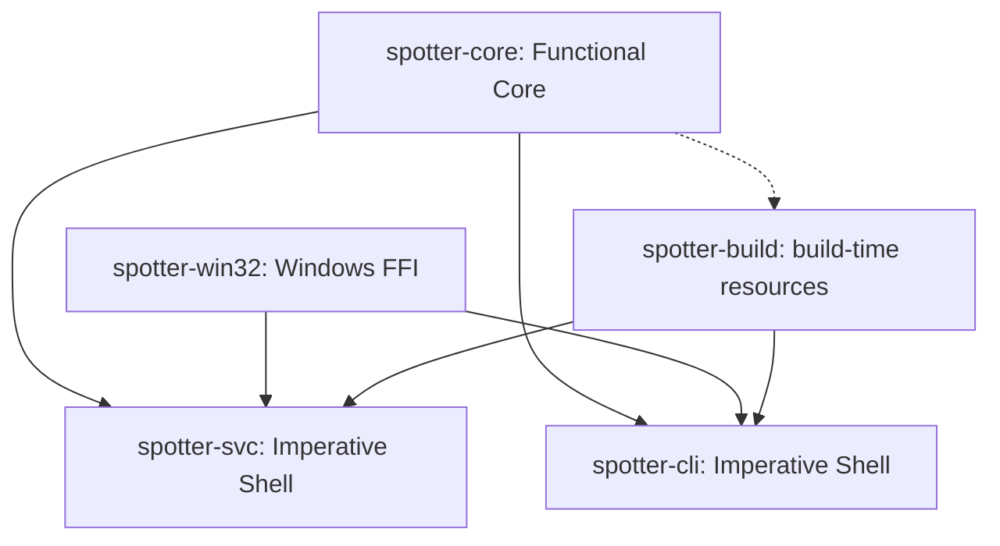
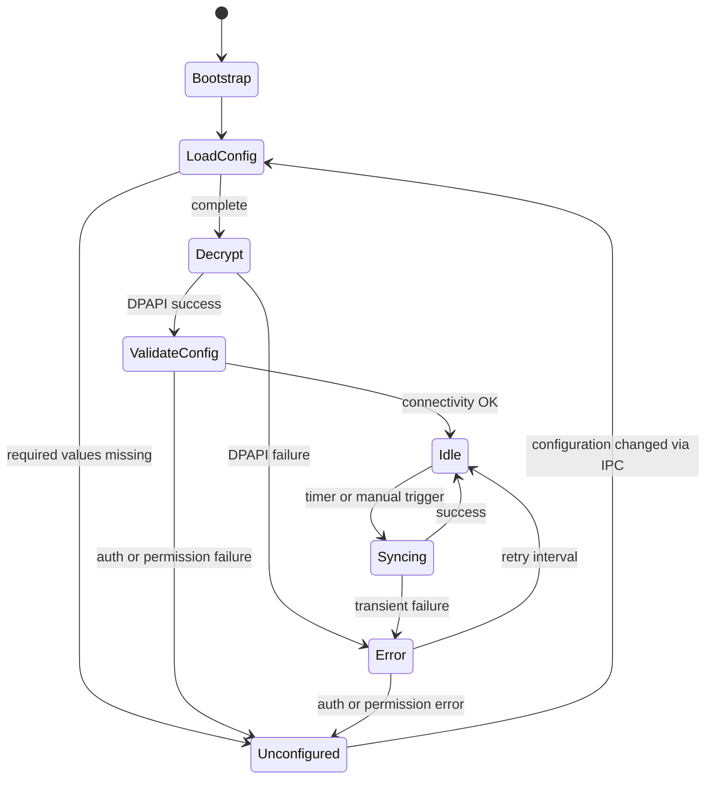
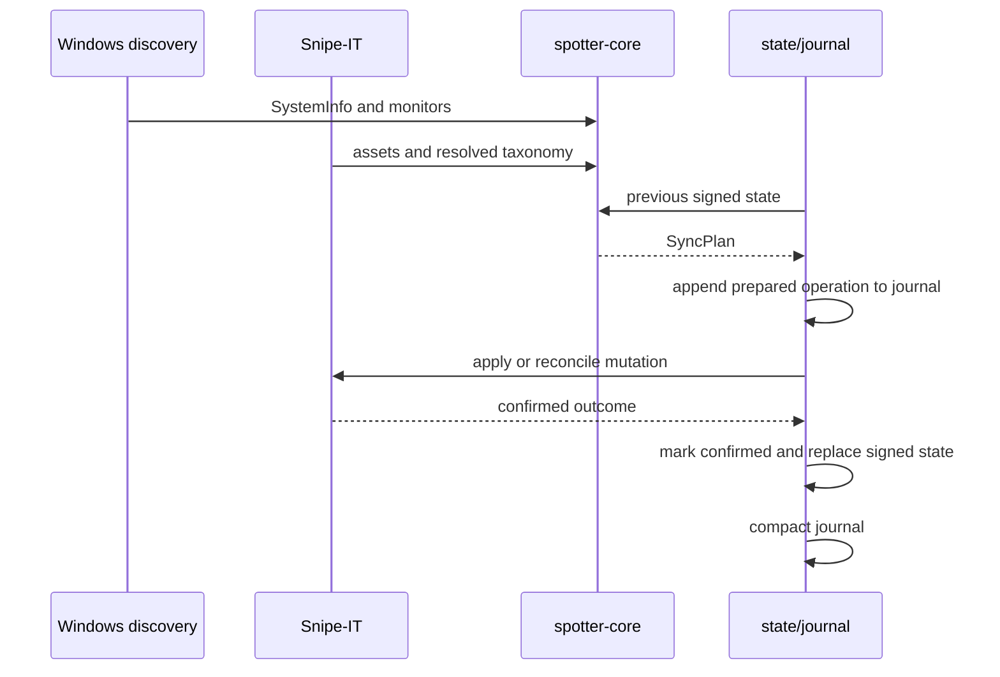

# SnipeSpotter architecture

SnipeSpotter separates deterministic decisions from operating-system and network I/O using the Functional Core / Imperative Shell (FCIS) pattern.

## Crate dependency graph

Dependency rules:

- `spotter-core` has zero I/O, no async, no platform-specific FFI. `cfg(windows)` is permitted only for path constants that select a directory root without performing I/O.
- `spotter-svc` and `spotter-cli` never import from each other.
- `spotter-win32` and `spotter-build` are Windows-only and never compile on non-Windows targets.
- `spotter-build` reads `spotter-core` source at build time (file parse, not crate dependency).

## Crate responsibilities

### spotter-core (Functional Core)

Owns all domain logic with no side effects:

- **Configuration schema** (`config.rs`): `Settings` with nested `SnipeItSettings`, `PollingSettings`, `LoggingSettings`, `MonitorSettings`. TOML round-trip, `serde(default)`, `config_status()` for missing-field detection.
- **Identity constants** (`identity.rs`): `PRODUCT_NAME`, `COMPANY_NAME`, derived `SERVICE_NAME`, `PIPE_NAME`, `MUTEX_NAME`, and `data_dir()`.
- **SMBIOS parser** (`smbios.rs`): `parse_smbios_tables(raw: &[u8]) -> Result<SystemInfo, SmbiosParseError>`. Parses Type 1/2/3 tables and string tables. `ChassisType` with `is_portable()` for types 8-12, 14, 30-32.
- **Monitor data** (`monitors.rs`): `MonitorInfo`, `MonitorSyncState`, `MonitorSyncEntry`. `diff_monitors()` computes new/removed/unchanged monitors with typed UTC timestamps.
- **Snipe-IT models** (`snipeit/`): `Asset`, `AssetModel`, `Manufacturer`, `Category` response types. Request builders for PATCH, checkout, and check-in. Endpoint-specific classifiers that consume HTTP status + wire body and return structured `SnipeItError` variants.
- **Sync planning** (`sync.rs`): `plan_sync()` is the pure planner. Takes resolved taxonomy, monitor state, policy, and a supplied `now` timestamp. Returns `SyncPlan` with asset updates, checkouts, checkins, next monitor state, and warnings. Missing taxonomy suppresses mutations and emits warnings.
- **IPC protocol** (`ipc.rs`): `ServiceCommand` and `IpcResponse` enums with serde tagging. `SettingsUpdate` for typed config field updates. `validate_config_field()` for client-side validation. 64 KiB line limit.
- **Service state** (`state.rs`): `ServiceState` with HMAC-SHA256 signing. `canonical_bytes()` excludes the HMAC field. Constant-time verification via `subtle`.

### spotter-win32 (Windows FFI)

Narrowly scoped unsafe wrappers with RAII ownership:

- **DPAPI** (`dpapi.rs`): `encrypt()` / `decrypt()` using `CryptProtectData` / `CryptUnprotectData` with `CRYPTPROTECT_LOCAL_MACHINE` and `CRYPTPROTECT_UI_FORBIDDEN`. Output buffers are copied to Rust-owned vectors and freed with `LocalFree` via RAII guard.
- **Named mutex** (`mutex.rs`): `try_acquire_global_mutex()` using `CreateMutexW` with `ERROR_ALREADY_EXISTS` detection. Mutex name: `Global\SnipeSpotter`.
- **Pipe DACL** (`pipe.rs`): `create_admin_pipe_security_attributes()` builds an SDDL descriptor granting generic-all to SYSTEM (`SY`) and built-in Administrators (`BA`), with no handle inheritance.
- **Elevation** (`elevation.rs`): `is_elevated()` checks whether the current process has administrator rights.

### spotter-build (Build helper)

Parses `PRODUCT_NAME` and `COMPANY_NAME` from `spotter-core/src/identity.rs` at build time and passes them as preprocessor defines to the RC compiler. Embeds `VERSIONINFO` and STRINGTABLE resources. The CLI exe gets a `requireAdministrator` manifest; the service exe gets `asInvoker`.

### spotter-svc (Service shell)

Implements the Gather -- Process -- Persist cycle:

- **FSM** (`fsm.rs`): Enum + match loop. All states visible in one function. The FSM is the single owner of active config, Snipe-IT client, sync execution, and in-memory state. Commands are serialized: one sync/check-in at a time, duplicate triggers coalesce, config updates commit atomically.
- **Production owner test boundary** (`service.rs`): `CommandOwner::handle` remains the production orchestration subject. Its external boundaries are intentionally narrow: secret protection, settings/state/journal persistence, clock/path inputs, hardware discovery, remote reads, and remote mutations. Test-support construction substitutes only those ports and uses unique temporary roots/endpoints; production construction continues to use DPAPI, ProgramData, Windows discovery, and the authenticated Snipe-IT client.
- **Hardware discovery** (`discovery.rs`): `discover_hardware()` calls `GetSystemFirmwareTable` for SMBIOS and WMI `WmiMonitorID` for monitors. Abstracted behind a `HardwareDiscovery` trait with real and mock implementations.
- **Snipe-IT client** (`snipeit_client.rs`): `reqwest`-based HTTP client with bearer token auth, rate limit handling (`X-RateLimit-Remaining`, `Retry-After`), pagination, and `Option<String>` base URL override for wiremock testing.
- **Sync engine** (`sync_engine.rs`): Orchestrates gather (discover hardware, find assets by serial, resolve taxonomy, load prior state) -- process (`plan_sync()`) -- persist (journal each operation, reconcile before execution, mark confirmed, persist state delta).
- **IPC server** (`ipc_server.rs`): Named-pipe server with JSON-over-newline protocol. Transport handlers validate framing and enqueue `FsmCommand` values to the FSM. Each request carries a one-shot response sender for committed results.
- **Config I/O** (`config_io.rs`): Crash-safe Windows replacement via `ReplaceFileW` / `MoveFileExW`. DPAPI decryption wraps the token in `SecretString`.
- **State I/O** (`state_io.rs`): HMAC-signed state with crash-safe replacement. HMAC key generated with `getrandom` on first run.
- **Operation journal** (`operation_journal.rs`): Append-only, fsynced journal of `Prepared` → `RemoteOutcomeObserved` → `StateCommitted` records with deterministic IDs. Recovery loads signed state plus pending evidence, reconciles only operations without an observed outcome, applies validated candidate-state evidence, and compacts only after the signed state commit.
- **Logging** (`logging.rs`): `tracing-subscriber` with `tracing-appender` rolling file appender. Daily rotation, configurable level and retention.
- **Service registration** (`service.rs`): `windows-service` crate for SCM integration. Service name: `SnipeSpotter`, account: `LocalSystem`, start type: automatic.

### spotter-cli (CLI)

`clap` derive with nested subcommands. Depends on injectable `IpcTransport`, `ServiceRegistrar`, `ElevationChecker`, and `TokenReader` ports. Unit tests use fakes; production adapters perform named-pipe, SCM, console, and elevation I/O.

## Service lifecycle (FSM)

Key FSM properties:

- The FSM is the single owner of active config, Snipe-IT client, sync/check-in execution, and in-memory service state.
- IPC transport accepts connections in all states, but handlers enqueue typed `FsmCommand` values to the FSM over a bounded channel. The FSM serializes all mutations.
- Duplicate `TriggerSync` requests coalesce with an already queued or running sync.
- `CheckinAll` and `CheckinSerial` are serialized after any active sync and operate on the latest committed monitor state.
- State transitions write to `state.toml` before sending notifications (commit-before-notify).

## Synchronization flow

Operation recovery:

- Before each external mutation, the engine durably appends a `Prepared` record keyed by a deterministic `operation_id` (operation kind + source asset + target/status + sync generation) and binds the serialized operation payload to that ID.
- Before execution, the engine reconciles the current server assignment/status. If the desired state is already applied, it treats that as success.
- After each confirmed or reconciled response, the engine durably appends `RemoteOutcomeObserved` with a validated complete candidate signed-state snapshot. The candidate includes the exact matched-asset and monitor state reached by that operation, including authoritative PATCH metadata.
- The owner persists the candidate signed state before appending `StateCommitted`; only then may it compact the journal. A failed state save or journal commit leaves the prior active state or recoverable evidence intact.
- On restart, recovery processes pending records in durable `Prepared` order, reconciles both prepared and observed operations against Snipe-IT, applies validated candidate snapshots or operation-specific legacy deltas to the loaded signed state, persists the result, appends `StateCommitted`, and compacts atomically.

## Security boundaries

- **API tokens**: Encrypted by the LocalSystem service with machine-scope DPAPI (`CRYPTPROTECT_LOCAL_MACHINE`). Plaintext never persists. The elevated CLI submits plaintext over the SYSTEM/admin-only pipe; the service performs encryption.
- **Named-pipe access**: Restricted to `NT AUTHORITY\SYSTEM` and `BUILTIN\Administrators` via an SDDL DACL (`D:P(A;;GA;;;SY)(A;;GA;;;BA)`). No handle inheritance.
- **ProgramData ACLs**: Settings, state, HMAC key, journal, and logs under `%ProgramData%\infogyre\SnipeSpotter\` with inheritable full control only to SYSTEM and Administrators.
- **Signed state**: HMAC-SHA256 over canonical JSON that excludes the HMAC field. Constant-time verification via `subtle`. Tampered state is rejected; the operator preserves files for diagnosis rather than deleting them.
- **IPC line limit**: 64 KiB maximum per request or response line to prevent DoS.
- **Elevation**: CLI manifest requires `requireAdministrator`. Runtime `is_elevated()` check as belt-and-suspenders backup.

## Hosted hardware experiment boundary

The optional hosted hardware experiment is deliberately separate from the product runtime and existing raw fixture recon scripts. It lives under `scripts/hardware/` and is invoked only by `.github/workflows/hardware-experiment.yml`; the workflow records the protected `awaiting_operator_hardware_approval` checkpoint after the observation matrix and before any promotion.

Its imperative-shell collector (`collect_hardware.ps1`) gathers only bounded summaries: requested runner image and alias, exact runner/build metadata, process bitness, caller class/context, the numeric Windows process session ID captured in each context, classified API results and durations, SMBIOS lengths/type histograms, WMI counts/array lengths/placeholder classes, chassis class counts, and HMAC fragments. The workflow creates one protected temporary HMAC key per image/repetition and shares it between direct-admin and LocalSystem collection; it is never uploaded and is removed during failure-safe cleanup. Raw firmware, EDID, WMI strings, serials, asset tags, environment dumps, tokens, and exception text are never emitted.

`privacy_policy.py` is the functional-core validator. It applies a closed schema, maximum sizes/counts, token/key/payload rejection, and the invariant that the HMAC key and raw values are absent from the report. `validate_report.py` emits only generic pass/fail text and runs before artifact upload. Reports are diagnostic-only, retained for at most seven days, and cannot promote releases, mutate Snipe-IT, or claim physical hardware coverage. See [the experiment policy](hardware-experiment-policy.md) and [report template](hardware-report-template.md).

## Monitor check-in policy

| Policy | Behavior |
|---|---|
| `Manual` | Never automatically checks in monitors. Operator must use `spotter-cli checkin`. |
| `AutoNonPortable` | Checks in an absent monitor only when: (1) SMBIOS chassis type is non-portable, (2) the monitor was previously checked out, (3) `now - absent_since >= checkin_threshold_hours`. |

Portable chassis types (suppressed auto check-in): 8 (Portable), 9 (Laptop), 10 (Notebook), 11 (Hand Held), 12 (Docking Station), 14 (Sub Notebook), 30 (Tablet), 31 (Convertible), 32 (Detachable).

A present monitor clears its `absent_since` timestamp. A newly absent monitor sets it to the current `now`. Continued absence preserves the original timestamp. The CLI `checkin --all` and `checkin <serial>` commands force check-in regardless of policy.
