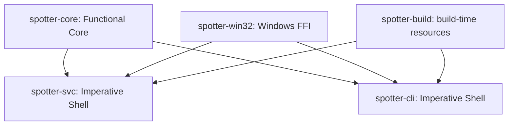
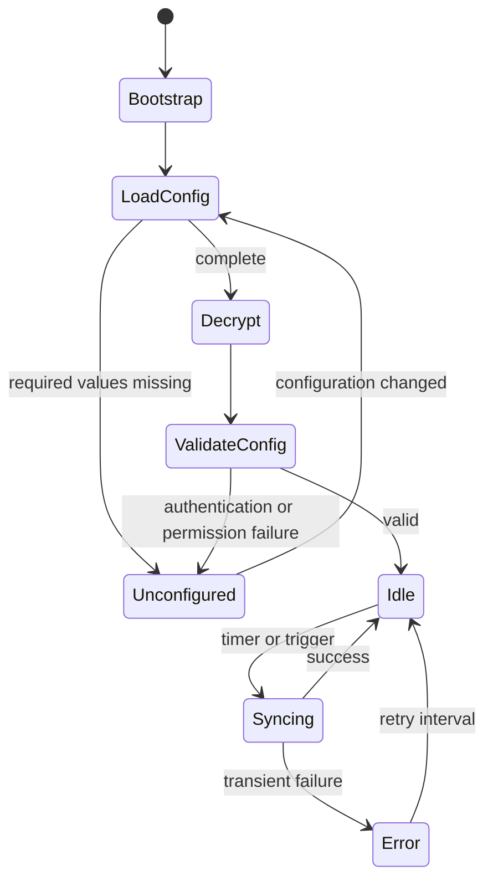
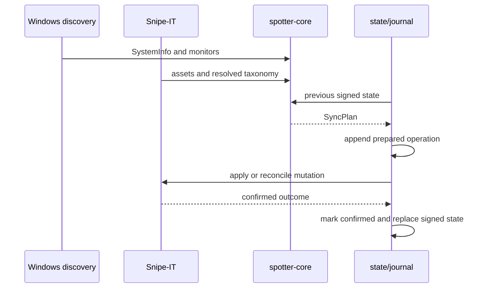

# SnipeSpotter architecture

SnipeSpotter separates deterministic decisions from operating-system and network I/O.

`spotter-core` owns configuration, SMBIOS parsing, monitor state, Snipe-IT wire classification, sync planning, IPC types, and signed state. It receives timestamps and keys as inputs and performs no file, network, async, or Windows I/O.

`spotter-win32` owns DPAPI, the process mutex, named-pipe security attributes, and elevation checks. Each Windows allocation or handle has an RAII owner.

`spotter-svc` gathers hardware and remote state, calls the core planner, and persists confirmed outcomes. `spotter-cli` converts operator commands into IPC requests. Neither shell imports from the other.

## Service lifecycle

The service controller is the single owner of active settings and synchronization state. Duplicate triggers coalesce. State is committed before success is returned to IPC clients.

## Synchronization flow

Prepared operations use deterministic identifiers. Recovery reconciles remote state before retrying an uncertain mutation.

## Security boundaries

- API tokens are encrypted by the LocalSystem service with machine-scope DPAPI.
- Named-pipe access is restricted to SYSTEM and built-in Administrators.
- Settings, state, key, journal, and logs belong under `%ProgramData%\infogyre\SnipeSpotter` with equivalent ACLs.
- Signed state uses HMAC-SHA256 over canonical JSON that excludes the HMAC field.
- IPC lines are bounded to 64 KiB.
